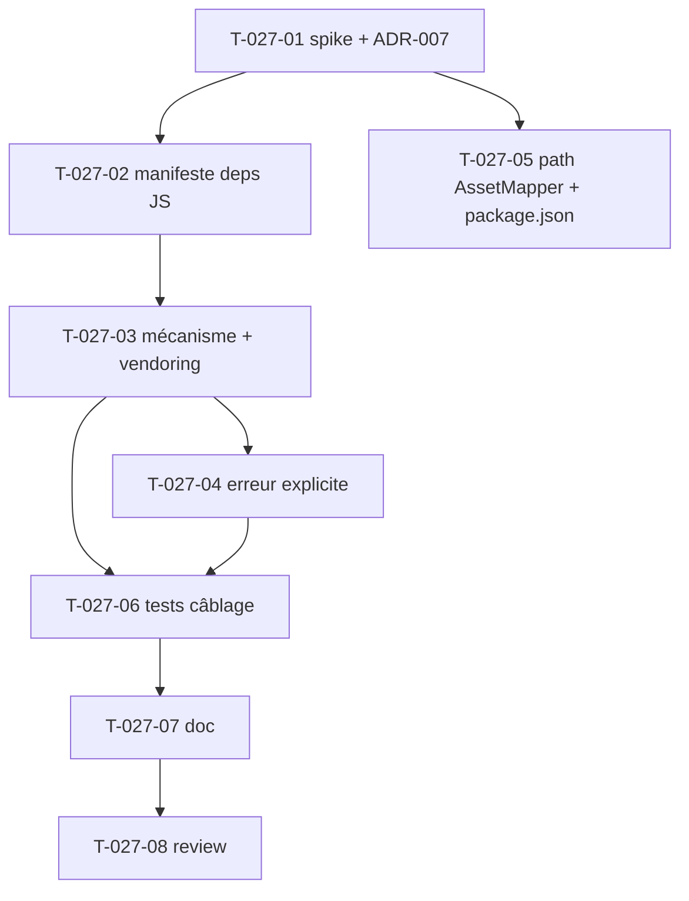

# Tâches — US-027 : Recette d'assets — importmap fourni par le bundle

## Informations US
- **Epic** : EPIC-008-distribution-consommabilite · **Persona** : P-003 · **Points** : 8 · **Sprint** : sprint-008

## Résumé
**En tant que** mainteneur/consommateur du bundle **je veux** que le bundle déclare lui-même les libs JS de ses contrôleurs Stimulus (ApexCharts, jsvectormap, flatpickr, Dropzone, FullCalendar) dans l'importmap de l'app hôte **afin de** ne PAS recopier `demo/importmap.php` à la main lors de l'intégration (hottwos).

> Aujourd'hui les pins vivent dans `demo/importmap.php` (**exclu du package** via `.gitattributes` export-ignore) : un tiers ne les reçoit pas. Le `prepend()` du bundle ne gère que le namespace Twig, le path AssetMapper des contrôleurs et les traductions — pas les libs. Sans CDN (ADR-004/006). Cœur du sprint.

## Vue d'ensemble des tâches

| ID | Type | Tâche | Est. | Dépend de | Statut |
|----|------|-------|------|-----------|--------|
| T-027-01 | [BE] | Spike + ADR-007 : mécanisme de propagation des pins importmap | 3h | — | ✅ |
| T-027-02 | [BE] | Manifeste des dépendances JS du bundle (sorti de `demo/`) | 2.5h | T-027-01 | ✅ |
| T-027-03 | [BE] | Implémenter le mécanisme retenu + vendoring offline | 4h | T-027-02 | ✅ |
| T-027-04 | [BE] | Erreur explicite si lib non vendorée (scénario 3) | 2.5h | T-027-03 | ✅ |
| T-027-05 | [FE-WEB] | Fiabiliser le path AssetMapper + synchro `package.json` | 2h | T-027-01 | ✅ |
| T-027-06 | [TEST] | Tests fonctionnels du câblage assets | 2.5h | T-027-03, T-027-04 | ✅ |
| T-027-07 | [DOC] | Procédure d'install des assets (README + docs) | 1h | T-027-06 | ✅ |
| T-027-08 | [REV] | Review | 0.5h | T-027-07 | ✅ |

**Total : 18h — US-027 terminée (2026-09-08)**

---

## Détail

### T-027-01 · [BE] Spike + ADR-007 : mécanisme de propagation des pins — 3h
**Objet** : arbitrer techniquement COMMENT le bundle fournit ses libs JS à l'importmap de l'hôte.
**Fichiers** : `src/TailsfadminBundle.php` (méthode `prepend()`, lignes 105-130), `docs/adr/ADR-007-propagation-importmap.md` (nouveau).
**Pistes à évaluer** :
- (a) `prependExtensionConfig('importmap', …)` — vérifier si l'API AssetMapper accepte des entrées via prepend et si elles **survivent au merge** (le prepend du path AssetMapper actuel ne survit PAS — cf. `demo/config/packages/asset_mapper.yaml`).
- (b) commande console dédiée `tailsfadmin:assets:install` (pins + vendoring déclenché).
- (c) `importmap.php` partiel documenté + snippet à insérer.
**Critères** :
- [ ] Décision tranchée et justifiée dans ADR-007 (statut : Accepté).
- [ ] Risque « prepend importmap ne survit pas au merge » confirmé ou infirmé par un essai.
- [ ] Fallback documenté si (a) impossible → (b) commande.

### T-027-02 · [BE] Manifeste des dépendances JS du bundle — 2.5h
**Objet** : centraliser hors `demo/` la liste des libs pinées requises par les 13 contrôleurs.
**Fichiers** : source de vérité selon décision T-027-01 (ex. `config/importmap.php` du bundle, ou `assets/dependencies.php`) ; référence `demo/importmap.php` (pins actuels : `apexcharts 7.1.0`, `apexcharts/core 7.1.0`, `jsvectormap 1.7.0` + `world.js` + CSS, `flatpickr 4.6.13` + CSS, `dropzone 6.2.0` + CSS, `fullcalendar 6.1.21` + shim ESM `demo/assets/vendor/fullcalendar/fullcalendar-esm.js`).
**Critères** :
- [ ] Toutes les libs des contrôleurs `apexcharts`, `vectormap`, `datepicker`, `dropzone`, `calendar` recensées avec **versions pinées**.
- [ ] Les shims (FullCalendar ESM) et CSS associés inclus.
- [ ] Aucune dépendance CDN (ADR-004/006).

### T-027-03 · [BE] Implémenter le mécanisme retenu + vendoring — 4h
**Fichiers** : `src/TailsfadminBundle.php` (`prepend()`) et/ou `src/Command/AssetsInstallCommand.php` (nouveau si voie (b)), `config/services.yaml`.
**Critères** :
- [ ] Après l'étape d'install, l'importmap de l'hôte contient les entrées attendues (versions pinées).
- [ ] Les fichiers sont **vendorés localement** (aucun CDN au runtime).
- [ ] Les contrôleurs sans dépendance externe (`theme`, `sidebar`, `modal`, `dropdown`, `alert_dismiss`, `preloader`, `search`, `submenu`) restent fonctionnels via le path AssetMapper déjà exposé (`bundles/tailsfadmin`).

### T-027-04 · [BE] Erreur explicite si lib non vendorée — 2.5h
**Objet** : scénario Gherkin 3 (absence de lib requise).
**Critères** :
- [ ] Quand une page charge un composant dont la lib n'est pas vendorée, une **erreur explicite en console** indique la commande à exécuter (ex. `bin/console importmap:install` ou `tailsfadmin:assets:install`).
- [ ] Message actionnable (nomme la lib et l'étape manquante).

### T-027-05 · [FE-WEB] Fiabiliser le path AssetMapper + synchro package.json — 2h
**Fichiers** : `src/TailsfadminBundle.php` (`prepend()`), `package.json` (racine), `assets/package.json`.
**Critères** :
- [ ] Le path des contrôleurs (`bundles/tailsfadmin`) est exposé de façon fiable côté hôte (prepend fiabilisé OU re-déclaration documentée/recette) — corrige le « prepend ne survit pas au merge ».
- [ ] `package.json` racine (aujourd'hui `0.1.0`, **1 seul contrôleur** `preloader`) synchronisé avec `assets/package.json` (**13 contrôleurs**) ; clarifier lequel fait foi pour UX (`assets/package.json`).

### T-027-06 · [TEST] Tests fonctionnels du câblage assets — 2.5h
**Fichiers** : `tests/Functional/AssetsWiringTest.php` (nouveau).
**Critères** :
- [ ] La configuration importmap générée par le bundle contient les entrées attendues (versions pinées).
- [ ] Auto-registration des 13 contrôleurs Stimulus vérifiée.
- [ ] (Montage JS réel au navigateur = US-030, hors périmètre ici.)

### T-027-07 · [DOC] Procédure d'install des assets — 1h
**Fichiers** : `README.md`, `docs/` (section assets).
**Critères** : commande d'install documentée, vendoring offline expliqué, rappel no-CDN.

### T-027-08 · [REV] Review — 0.5h
Relecture BE/assets ; ADR-007 relu ; DoD.

## Graphe

## Dépendances
- **Dépend de** : bundle v1.0.0 (contrôleurs + composants Chart).
- **Bloque** : US-029, US-030, US-031.
