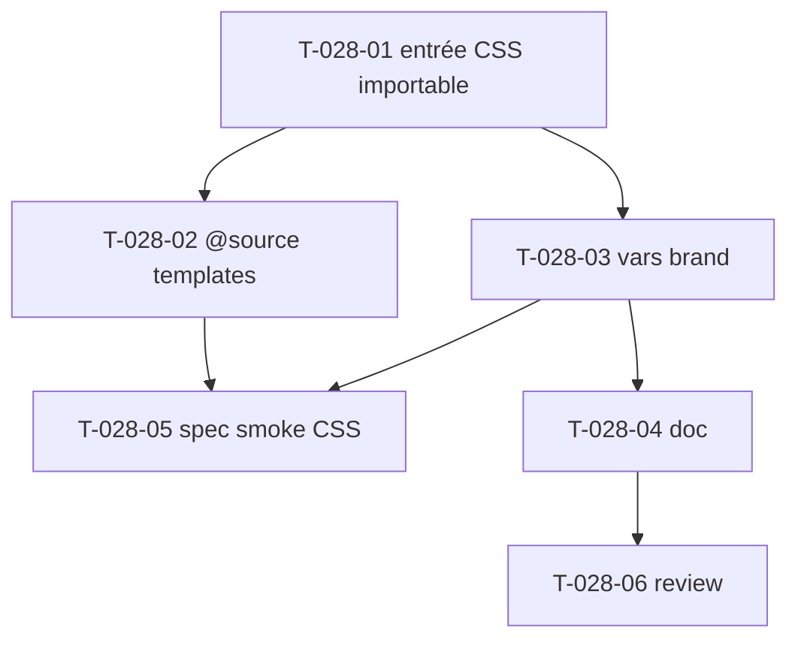

# Tâches — US-028 : Distribution du thème CSS Tailwind (tokens + @source)

## Informations US
- **Epic** : EPIC-008-distribution-consommabilite · **Persona** : P-003 · **Points** : 5 · **Sprint** : sprint-008

## Résumé
**En tant que** consommateur du bundle **je veux** importer le thème CSS de tailsfadmin (tokens, dark, `@source` templates) en **une seule ligne** dans mon `app.css` **afin de** styliser mon app sans recopier `assets/styles/app.css`, et pouvoir surcharger les couleurs de marque.

> Le bundle contient `assets/styles/app.css` (entrée Tailwind v4 standalone, no-Node — ADR-001) : `@import "tailwindcss"`, `@source "../../templates"` + `@source "../controllers"`, `@plugin @tailwindcss/forms`, `@custom-variant dark`, `@theme` (tokens TailAdmin). Ce CSS n'est **pas** exposé par AssetMapper : le consommateur doit l'importer dans sa propre chaîne Tailwind — d'où cette US.

## Vue d'ensemble des tâches

| ID | Type | Tâche | Est. | Dépend de | Statut |
|----|------|-------|------|-----------|--------|
| T-028-01 | [FE-WEB] | Point d'entrée CSS `@import`-able distribué (tokens + `@layer` + dark) | 3h | — | 🔲 |
| T-028-02 | [FE-WEB] | `@source` scannant les templates du bundle côté hôte | 2h | T-028-01 | 🔲 |
| T-028-03 | [FE-WEB] | Variables de marque `--color-brand-*` surchargeables après import | 2h | T-028-01 | 🔲 |
| T-028-04 | [DOC] | Doc intégration Tailwind hôte (standalone, 1 ligne, brand, `.dark`) | 1.5h | T-028-03 | 🔲 |
| T-028-05 | [TEST] | Spec smoke CSS (exécutée dans US-030) | 1.5h | T-028-02, T-028-03 | 🔲 |
| T-028-06 | [REV] | Review CSS + revue visuelle clair/dark | 0.5h | T-028-04 | 🔲 |

**Total : 10.5h**

---

## Détail

### T-028-01 · [FE-WEB] Point d'entrée CSS importable — 3h
**Objet** : fournir un fichier CSS distribué par le bundle, importable par l'hôte en une ligne, apportant tokens `@theme` + `@layer` composants + dark.
**Fichiers** : `assets/styles/theme.css` (nouveau, distribué) extrait/organisé depuis `assets/styles/app.css` ; l'`app.css` de la démo l'importe pour ne pas dupliquer.
**Critères** :
- [ ] Un unique `@import` côté hôte apporte : tokens (`@theme` : couleurs, `--font-outfit`, breakpoints custom, tailles titre), classes composants (`.menu-item-*`, `.jvm-*`, focus-visible), dark mode.
- [ ] Les chemins `@source` restent **relatifs au fichier distribué** → portables une fois le bundle en `vendor/`.
- [ ] Le `@import url(Outfit) layer(base)` et `@plugin @tailwindcss/forms` conservés (anti-FOUC, forms).

### T-028-02 · [FE-WEB] `@source` templates du bundle côté hôte — 2h
**Objet** : garantir que les utilitaires Tailwind employés dans les templates du bundle sont **générés** chez l'hôte (incident Sprint 2 : classes manquantes).
**Fichiers** : `assets/styles/theme.css` (`@source`).
**Critères** :
- [ ] `@source` pointe les templates du bundle (`templates/components/**`, layouts) de manière portable en `vendor/`.
- [ ] Vérifié : une classe utilitaire présente uniquement dans un template bundle est bien générée côté hôte (validé en US-030).

### T-028-03 · [FE-WEB] Variables de marque surchargeables — 2h
**Fichiers** : `assets/styles/theme.css` (`@theme` / `:root`).
**Critères** :
- [ ] Au minimum `--color-brand-*` exposées et surchargeables par l'hôte **après** l'import (cascade correcte).
- [ ] Redéfinir `--color-brand-500` change boutons, liens, menu actif.

### T-028-04 · [DOC] Doc intégration Tailwind hôte — 1.5h
**Fichiers** : `README.md`, `docs/` (section thème CSS).
**Critères** : binaire Tailwind standalone (no-Node), ligne d'import unique, surcharge brand, activation `.dark` sur `<html>`.

### T-028-05 · [TEST] Spec smoke CSS — 1.5h
**Objet** : spécifier les assertions CSS exécutées par le smoke test d'intégration (US-030).
**Critères** :
- [ ] Classes composants générées (rendu correct).
- [ ] Brand surchargée appliquée.
- [ ] Dark mode : surfaces sombres appliquées, **pas d'inversion des gris** (garde v1 — action rétro).

### T-028-06 · [REV] Review — 0.5h
Relecture CSS distribuable ; revue visuelle clair/dark ; DoD.

## Graphe

## Dépendances
- **Dépend de** : bundle v1.0.0 (`assets/styles/app.css`).
- **Bloque** : US-029, US-030.
