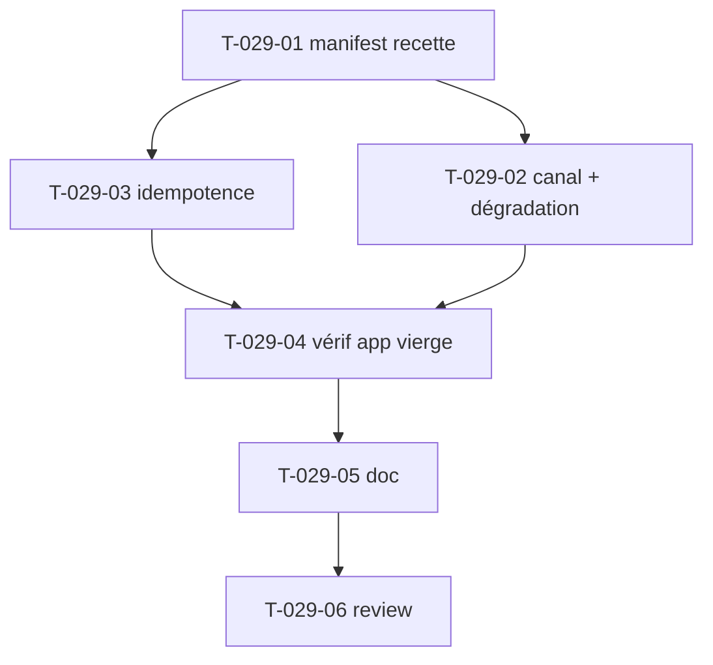

# Tâches — US-029 : Flex recipe (configuration automatique) — 🟣 STRETCH

## Informations US
- **Epic** : EPIC-008-distribution-consommabilite · **Persona** : P-003 · **Points** : 5 · **Sprint** : sprint-008 (réserve/stretch)

## Résumé
**En tant que** consommateur du bundle **je veux** qu'à l'installation, Symfony Flex configure automatiquement le bundle (enregistrement `bundles.php`, `config/packages/tailsfadmin.yaml` par défaut, rappel des étapes assets) **afin de** démarrer sans configuration manuelle.

> **Stretch** : couche de confort par-dessus US-027/028. Contribuée seulement **si capacité** et **après** publication Packagist (US-031) — une contrib à `symfony/recipes-contrib` suppose le package publié. Ne doit rien casser si l'app n'utilise pas AssetMapper (dégradation documentée).

## Vue d'ensemble des tâches

| ID | Type | Tâche | Est. | Dépend de | Statut |
|----|------|-------|------|-----------|--------|
| T-029-01 | [OPS] | Manifest recette (bundles.php, `tailsfadmin.yaml`, post-install-message) | 3h | US-027, US-028 | ✅ |
| T-029-02 | [OPS] | Canal recette (contrib publique vs endpoint privé) + dégradation | 2h | T-029-01 | ✅ |
| T-029-03 | [BE] | Idempotence (pas d'écrasement sans confirmation) | 2h | T-029-01 | ✅ |
| T-029-04 | [TEST] | Vérif via app vierge (US-030) | 2.5h | T-029-03, US-030 | 🟡 |
| T-029-05 | [DOC] | Doc recette + procédure de contribution | 1h | T-029-04 | ✅ |
| T-029-06 | [REV] | Review | 0.5h | T-029-05 | ✅ |

**Total : 11h — recette livrée (prête pour recipes-contrib), 2026-09-08**

> **Livrables** : `recipe/tailsfadmin/tailsfadmin-bundle/1.0/` (manifest.json +
> `config/packages/tailsfadmin.yaml` + `tailsfadmin_assets.yaml`), `recipe/README.md`.
> `recipe/` en **export-ignore** (destiné à recipes-contrib, pas au package).
> - **T-029-01** : enregistrement bundle (`Tailsfadmin\TailsfadminBundle`), config
>   par défaut (menu + locales fr/en/ar/es/de), message post-install (assets 027 + CSS 028).
> - **T-029-02** : canal = `recipes-contrib` (post-Packagist) ou endpoint privé
>   (documentés) ; path AssetMapper dans un fichier séparé → dégradation propre
>   sans AssetMapper (clé inerte).
> - **T-029-03** : idempotence via `copy-from-recipe` (Flex n'écrase pas) + config
>   assets additive (fichier dédié).
> - **T-029-04 (🟡 partiel)** : gardes anti-dérive en CI (`RecipeManifestTest`,
>   4 tests) ; la vérif live e2e exige un canal actif (Packagist/recipes-contrib).
> - **T-029-05/06** : `recipe/README.md` (fonctionnement, contribution, endpoint
>   privé, dégradation) ; gates verts (32 tests, PHPStan max, CS).

---

## Détail

### T-029-01 · [OPS] Manifest recette Flex — 3h
**Objet** : fournir enregistrement + config par défaut + rappel assets.
**Fichiers** : `manifest.json` + `config/packages/tailsfadmin.yaml` (dans le dépôt de recette / structure recipes-contrib) ; référence `demo/config/packages/tailsfadmin.yaml`.
**Critères** (Gherkin) :
- [ ] `composer require` → bundle enregistré dans `config/bundles.php`.
- [ ] `config/packages/tailsfadmin.yaml` par défaut créé (menu minimal + locales `fr,en,ar,es,de`, `default_locale: fr`).
- [ ] Message post-install rappelant les commandes d'assets (US-027) et l'import CSS (US-028).

### T-029-02 · [OPS] Canal recette + dégradation — 2h
**Critères** :
- [ ] Voie retenue : contrib publique `symfony/recipes-contrib` (post-Packagist) OU endpoint Flex privé du dépôt.
- [ ] Ne casse rien si l'app **n'utilise pas AssetMapper** (dégradation documentée).

### T-029-03 · [BE] Idempotence — 2h
**Critères** :
- [ ] Ré-application de la recette : **aucune config existante écrasée sans confirmation**.

### T-029-04 · [TEST] Vérif via app vierge — 2.5h
**Objet** : l'app d'intégration US-030 valide la recette.
**Critères** :
- [ ] `config/bundles.php` + `config/packages/tailsfadmin.yaml` générés.
- [ ] Message post-install présent.

### T-029-05 · [DOC] Doc recette + contribution — 1h
**Critères** : doc de la recette + procédure de contribution à `symfony/recipes-contrib`.

### T-029-06 · [REV] Review — 0.5h
Relecture manifest + idempotence ; DoD.

## Graphe

## Dépendances
- **Dépend de** : US-027, US-028 (+ US-030 pour la vérif, US-031 pour la contrib publique).
- **Bloque** : contribution recette à `recipes-contrib` (confort d'onboarding).
