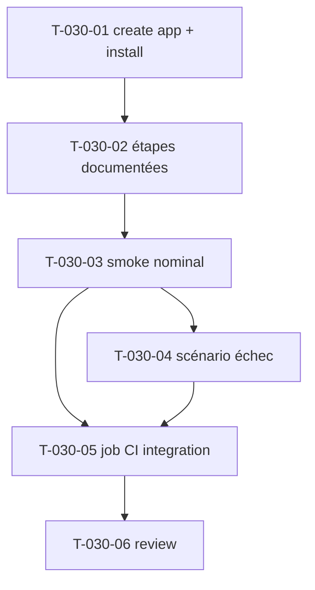

# Tâches — US-030 : Test d'intégration dans une app Symfony vierge (CI)

## Informations US
- **Epic** : EPIC-008-distribution-consommabilite · **Persona** : P-003 · **Points** : 5 · **Sprint** : sprint-008

## Résumé
**En tant que** mainteneur **je veux** un job CI qui crée une app Symfony neuve, y installe le bundle (comme un tiers) et vérifie qu'une page admin s'affiche et fonctionne **afin de** garantir que la consommabilité (US-027/028/029) marche hors du monorepo de la démo.

> La démo consomme le bundle en **path repository** (couplée) : elle ne prouve pas l'expérience tierce. Ce test crée un projet Symfony minimal (skeleton + AssetMapper), installe le bundle via le canal cible (VCS/path avant publication ; Packagist après US-031), applique les étapes documentées, et lance un smoke test. **La CI EST le test** (vert/rouge).

## Vue d'ensemble des tâches

| ID | Type | Tâche | Est. | Dépend de | Statut |
|----|------|-------|------|-----------|--------|
| T-030-01 | [OPS] | Script création app Symfony neuve + install bundle (VCS/path) | 3h | US-027, US-028 | ✅ |
| T-030-02 | [OPS] | Appliquer les étapes documentées (assets 027, CSS 028, recette 029 si prête) | 2h | T-030-01 | ✅ |
| T-030-03 | [TEST] | Smoke : layout admin → 200 + sidebar/header + CSS + 1 composant JS | 3h | T-030-02 | ✅ |
| T-030-04 | [TEST] | Scénario d'échec (vendoring manquant → rouge + message) | 1.5h | T-030-03 | ✅ |
| T-030-05 | [OPS] | Job CI `integration` bloquant sur PR (matrice Symfony si pertinent) | 1.5h | T-030-03, T-030-04 | ✅ |
| T-030-06 | [REV] | Review | 0.5h | T-030-05 | ✅ |

**Total : 11.5h — US-030 implémentée (2026-09-08)**

> **Décisions (validées)** : installation via **archive dist** (`composer archive`,
> honore export-ignore → fidèle Packagist) ; **app éphémère** (recréée par le job,
> hors dépôt) ; **matrice Symfony 7.3 + 8.0** (`SYMFONY_REQUIRE`).
> **Livrables** : `tests/integration/{create-app,apply-steps}.sh`, `fixtures/*`,
> job `integration` dans `ci.yml` (deux phases : échec avant vendoring → nominal
> après). Garde-fou d'échec rendu déterministe via un marqueur DOM
> `data-tailsfadmin-missing-libs` ajouté au préflight US-027.
> **✅ CI VERTE (PR #1)** — job `integration` au vert. Le test a exposé et fait
> corriger plusieurs vrais défauts de consommabilité, invisibles dans la démo
> (couplée) :
> - dépendances implicites manquantes ajoutées au bundle : `symfony/asset`,
>   `symfony/form`, et `symfony/stimulus-bundle` élargi à `^3.0` ;
> - path AssetMapper `bundles/tailsfadmin` à déclarer côté hôte (le `prepend()`
>   ne survit pas au merge Flex) — documenté (README §1) + posé par apply-steps ;
> - scénario d'échec rendu déterministe au niveau importmap (les contrôleurs
>   `eager` cassent tout préflight navigateur quand une lib manque) ;
> - matrice réduite à la dernière Symfony stable (le forçage 7.3/8.0 via Flex
>   global ne réécrit pas le skeleton 8.x) — multi-version = suivi dédié.

---

## Détail

### T-030-01 · [OPS] Script création app vierge + install — 3h
**Fichiers** : `.github/workflows/ci.yml` (job `integration`), `tests/integration/create-app.sh` (nouveau) ou étapes inline du job.
**Critères** :
- [ ] `composer create-project symfony/skeleton` (versions cibles) + AssetMapper + Tailwind standalone.
- [ ] Installe le bundle via **VCS/path repository** (préparation ; bascule Packagist après US-031).
- [ ] App hors monorepo (répertoire distinct de `demo/`).

### T-030-02 · [OPS] Appliquer les étapes documentées — 2h
**Critères** :
- [ ] Étape assets US-027 (commande d'install / vendoring) appliquée.
- [ ] Étape CSS US-028 (import du thème + `@source`) appliquée.
- [ ] Recette US-029 appliquée **si prête** (sinon config manuelle documentée).
- [ ] Une route + page de test étendant le layout admin ajoutée à l'app.

### T-030-03 · [TEST] Smoke test app tierce — 3h
**Fichiers** : test Panther dans l'app générée (ex. `tests/Smoke/AdminPageSmokeTest.php`).
**Critères** (scénario nominal Gherkin) :
- [ ] Une page étend `@Tailsfadmin/layout/admin.html.twig` → HTTP **200** avec **sidebar + header** rendus.
- [ ] CSS du thème appliqué (**classes générées** — reprend la spec T-028-05, dark sans inversion des gris).
- [ ] Un **composant JS monte réellement** (ex. `tsf:Ui:Dropdown` ou `tsf:Ui:Modal` au navigateur).

### T-030-04 · [TEST] Scénario d'échec — 1.5h
**Critères** (scénario 2 Gherkin) :
- [ ] Sans l'étape de vendoring (US-027), charger un `tsf:Chart:*` fait **échouer** le test avec un message pointant l'étape manquante.

### T-030-05 · [OPS] Job CI `integration` — 1.5h
**Fichiers** : `.github/workflows/ci.yml`.
**Critères** :
- [ ] Job dédié (Chrome/ChromeDriver comme le job `e2e` existant : `PANTHER_NO_SANDBOX`, `--headless=new`).
- [ ] **Bloquant sur PR**.
- [ ] Matrice de versions Symfony (`^7.3`, `^8.0`) si pertinent au regard du `require` composer.

### T-030-06 · [REV] Review — 0.5h
Relecture script + job ; DoD.

## Graphe

## Dépendances
- **Dépend de** : US-027, US-028 (US-029 si recette prête).
- **Bloque** : US-031 (publier après intégration prouvée).
