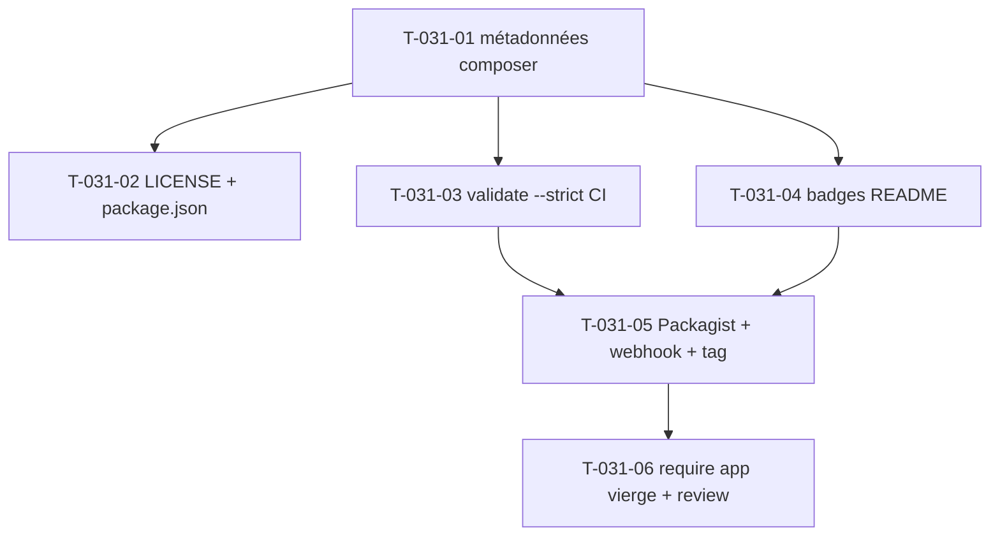

# Tâches — US-031 : Publication Packagist (canal de distribution)

## Informations US
- **Epic** : EPIC-008-distribution-consommabilite · **Persona** : P-003 · **Points** : 3 · **Sprint** : sprint-008

## Résumé
**En tant que** mainteneur **je veux** publier le bundle sur Packagist.org (public) **afin qu'**un `composer require tailsfadmin/tailsfadmin-bundle` fonctionne dans hottwos (et tout tiers) sans déclarer de dépôt VCS.

> « Packagist d'abord » : publication réalisée **une fois la consommabilité verte** (US-027..030). Une partie du travail est du **nettoyage de dette** identifié à l'audit : `version` figée, `LICENSE` absent, `package.json` racine désynchronisé, URLs GitHub incohérentes, dépendances implicites absentes.

## Vue d'ensemble des tâches

| ID | Type | Tâche | Est. | Dépend de | Statut |
|----|------|-------|------|-----------|--------|
| T-031-01 | [OPS] | Nettoyage métadonnées `composer.json` | 2h | — | ✅ |
| T-031-02 | [DOC] | Créer `LICENSE` (MIT) + aligner `package.json` racine | 1h | T-031-01 | ✅ |
| T-031-03 | [OPS] | `composer validate --strict` en CI + vérif `.gitattributes` | 1h | T-031-01 | ✅ |
| T-031-04 | [DOC] | Badges README (Packagist, licence, CI, PHP) | 1h | T-031-01 | ✅ |
| T-031-05 | [OPS] | Soumission Packagist + webhook + tag | 1.5h | US-030, T-031-03, T-031-04 | ✅ |
| T-031-06 | [REV] | Vérif `composer require` app vierge + review | 0.5h | T-031-05 | ✅ |

**Total : 7h — partie autonome livrée (T-031-01→04, 2026-09-08)**

> **T-031-01** : `version: "1.0.0"` retirée (les tags Git font foi, cohérent avec
> `branch-alias`), dépendances implicites ajoutées en `require`
> (`symfony/stimulus-bundle ^2.0`, `symfony/translation`), bloc `support`
> (issues/source), URL canonique = `github.com/thibmonier/tailsfadmin` (vrai
> remote). `composer validate --strict` → **valid**, lock rafraîchi.
> **T-031-02** : `LICENSE` MIT créé ; `package.json` racine déjà clarifié
> (source de vérité UX = `assets/package.json`, cf. T-027-05).
> **T-031-03** : étape `composer validate --strict` **bloquante** dans le job
> `bundle` ; `.gitattributes` déjà conforme (garde-fou aussi dans create-app.sh).
> **T-031-04** : 5 badges (Packagist version/downloads, PHP, CI, licence) + URL
> de clone corrigée dans le README.
>
> **T-031-05 ✅ (2026-09-09)** : dépôt rendu **public**, tag **v1.1.0** poussé,
> package **publié sur Packagist** (`tailsfadmin/tailsfadmin-bundle`, versions
> v1.1.0 / v1.0.0 / dev-main). GitHub Release v1.1.0 créée. Auto-update (webhook /
> GitHub App Packagist) : configuration finale côté mainteneur.
> **T-031-06 ✅** : le `require` publié sur Packagist expose les bonnes contraintes
> (symfony/asset, form, stimulus `^2.20 || ^3.0`, asset-mapper, translation,
> ux-twig-component, php ≥8.5) — un consommateur reçoit exactement ce qu'il faut.
> La consommabilité runtime est prouvée par le test d'intégration (archive dist =
> contenu publié). `composer require tailsfadmin/tailsfadmin-bundle` fonctionne
> sans dépôt VCS déclaré.

---

## Détail

### T-031-01 · [OPS] Nettoyage métadonnées composer.json — 2h
**Fichiers** : `composer.json` (racine).
**Critères** :
- [ ] **Retirer `version: "1.0.0"` figée** (les tags Git font foi — cohérent avec `extra.branch-alias` `dev-main → 1.x-dev`).
- [ ] Vérifier `type: symfony-bundle`, `license: MIT`, `keywords`, `authors`.
- [ ] Ajouter les **dépendances implicites** en `require` (ou `suggest` documenté) : `symfony/asset-mapper`, `symfony/stimulus-bundle`, `symfony/translation`.
- [ ] Harmoniser `homepage` (`github.com/thibmonier/tailsfadmin`) avec l'URL de clone du README (`github.com/tailsfadmin/tailsfadmin-bundle`) — **une seule URL canonique**.

### T-031-02 · [DOC] LICENSE + alignement package.json racine — 1h
**Fichiers** : `LICENSE` (nouveau, MIT), `package.json` (racine).
**Critères** :
- [ ] Fichier `LICENSE` MIT créé (le README pointe vers `[LICENSE]` inexistant ; `composer.json` déclare MIT).
- [ ] `package.json` racine aligné (version `0.1.0` → cohérente ; contrôleurs) ou clarifié comme non-source-de-vérité (cf. T-027-05, `assets/package.json` fait foi pour UX).

### T-031-03 · [OPS] `composer validate --strict` en CI — 1h
**Fichiers** : `.github/workflows/ci.yml`.
**Critères** :
- [ ] Étape `composer validate --strict` ajoutée (bloquante).
- [ ] `.gitattributes` vérifié : `demo/`, `tests/`, `docs/`, `.github/` bien en `export-ignore` (l'archive Packagist ne contient que le bundle).

### T-031-04 · [DOC] Badges README — 1h
**Fichiers** : `README.md`.
**Critères** : badges **Packagist version + downloads**, **licence**, **CI** (workflow), **version PHP** ajoutés en tête (aucun badge aujourd'hui).

### T-031-05 · [OPS] Soumission Packagist + webhook + tag — 1.5h
**Objet** : acte de publication, **après US-030 verte**.
**Critères** (Gherkin) :
- [ ] Dépôt soumis à Packagist ; webhook GitHub → auto-update des tags configuré.
- [ ] Un tag stable poussé apparaît sur Packagist ; `composer require …:^1` installe le dernier tag stable.
- [ ] (Suite : envisager contrib recette Flex US-029 à `symfony/recipes-contrib`.)

### T-031-06 · [REV] Vérif require app vierge + review — 0.5h
**Critères** : `composer require tailsfadmin/tailsfadmin-bundle` réussit sur une app vierge **sans repository VCS déclaré** (lié à US-030 basculée sur Packagist). Review finale.

## Graphe

## Dépendances
- **Dépend de** : US-027, US-028, US-030 (intégration prouvée) ; US-029 (si contrib recette).
- **Bloque** : intégration Packagist-standard dans hottwos.
