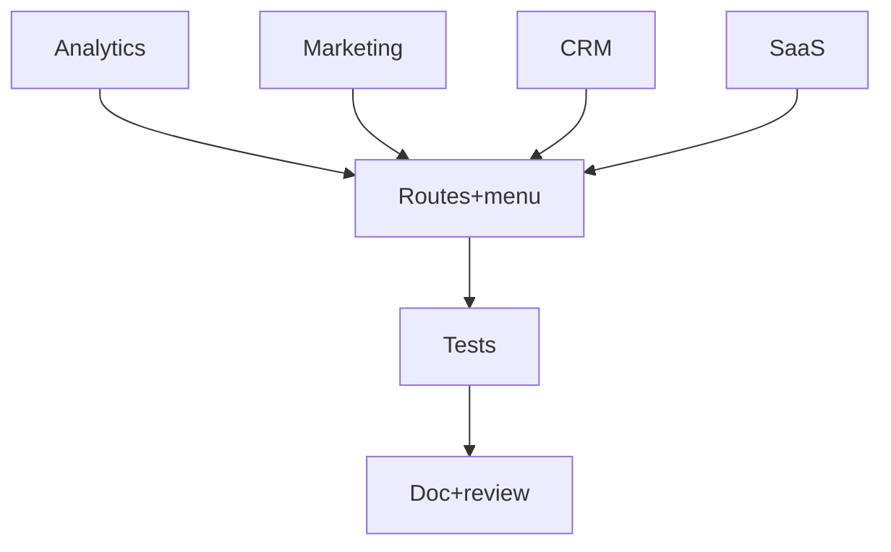

# Tâches — US-032 : Dashboards supplémentaires (Analytics, Marketing, CRM, SaaS)

## Informations US
- **Epic** : EPIC-009 · **Persona** : P-004 · **Points** : 8 · **Sprint** : sprint-009

## Résumé
**En tant que** P-004 (utilisateur admin) **je veux** plusieurs tableaux de bord métier,
**afin de** disposer de points de départ variés selon le domaine de mon application.
Assemblage pur (comme US-021) à partir des composants existants.

## Vue d'ensemble des tâches

| ID | Type | Tâche | Est. | Dépend de | Statut |
|----|------|-------|------|-----------|--------|
| T-032-01 | [FE-WEB] | Dashboard **Analytics** (KPI, chart sessions, sources, funnel, top pages) | 3h | — | ✅ |
| T-032-02 | [FE-WEB] | Dashboard **Marketing** (campagnes, ROI, audience, ProgressBar) | 2.5h | — | ✅ |
| T-032-03 | [FE-WEB] | Dashboard **CRM** (pipeline, deals, activités, table contacts) | 2.5h | — | ✅ |
| T-032-04 | [FE-WEB] | Dashboard **SaaS** (MRR, churn, cohortes, area/radial) | 2.5h | — | ✅ |
| T-032-05 | [FE-WEB] | Routes + entrée de menu (groupe « Dashboards ») + i18n fr/en/ar | 1.5h | T-032-01..04 | ✅ |
| T-032-06 | [TEST] | Tests fonctionnels (4 routes : 200 + structure clé) | 2h | T-032-05 | ✅ |
| T-032-07 | [REV] | Doc + review + revue visuelle clair/dark | 1.5h | T-032-06 | ✅ |

**Total : 15.5h**

---

## Détail

### T-032-01..04 · [FE-WEB] Les 4 dashboards
**Fichiers** : `demo/src/Controller/DashboardsController.php`, `demo/templates/dashboards/*.html.twig`.
**Critères** : chaque page étend `@Tailsfadmin/layout/admin.html.twig` ; réutilise KPI/cards,
charts (`tailsfadmin--apexcharts`), tables, `tsf:Ui:Badge`/`ProgressBar`/`Ribbon` ; données
statiques ; clair/dark ; responsive ; aucun nouveau composant sauf motif répété ≥ 3×.

### T-032-05 · [FE-WEB] Routes + menu + i18n
**Critères** : routes `/dashboards/{analytics,marketing,crm,saas}` (attributs `#[Route]`) ;
entrée de menu + clés `menu.dashboards*` dans les 3 catalogues.

### T-032-06 · [TEST] Tests fonctionnels
**Critères** : chaque route → 200 + présence des blocs clés (KPI, conteneur chart, table)
via `data-testid` ; ancrage sur `data-testid` comme les autres pages démo.

### T-032-07 · [REV] Doc + review
**Critères** : non-duplication vérifiée ; revue visuelle clair/dark (P-002) ; CHANGELOG.

## Graphe

## Résumé
| Type | Tâches | Heures |
|------|--------|--------|
| [FE-WEB] | 5 | 12h |
| [TEST] | 1 | 2h |
| [REV] | 1 | 1.5h |
| **TOTAL** | **7** | **15.5h** |
