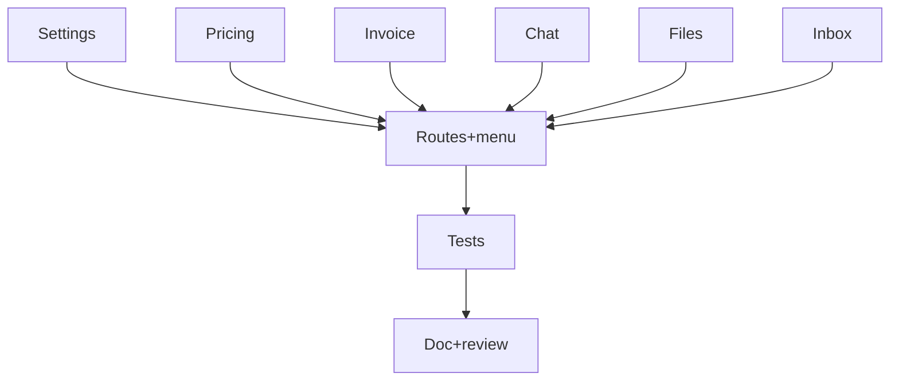

# Tâches — US-033 : Pages type applicatives

## Informations US
- **Epic** : EPIC-009 · **Persona** : P-004 · **Points** : 8 · **Sprint** : sprint-009

## Résumé
**En tant que** P-004 (utilisateur admin) **je veux** des pages type courantes,
**afin de** construire rapidement les écrans usuels d'un back-office.
**Kanban retiré** (déjà livré par US-040) ; **Tabs** déjà dispo (US-036).

## Vue d'ensemble des tâches

| ID | Type | Tâche | Est. | Dépend de | Statut |
|----|------|-------|------|-----------|--------|
| T-033-01 | [FE-WEB] | **Settings** (onglets `tsf:Ui:Tabs` + form theme) | 2h | — | 🔲 |
| T-033-02 | [FE-WEB] | **Pricing** (grille de plans + `tsf:Ui:Ribbon` « populaire ») | 2h | — | 🔲 |
| T-033-03 | [FE-WEB] | **Invoice** (facture imprimable, styles print) | 2h | — | 🔲 |
| T-033-04 | [FE-WEB] | **Chat** (liste conversations + fil de messages) | 3h | — | 🔲 |
| T-033-05 | [FE-WEB] | **File manager** (grille/liste + Dropzone existant) | 3h | — | 🔲 |
| T-033-06 | [FE-WEB] | **Inbox** (liste mails + volet lecture) | 2.5h | — | 🔲 |
| T-033-07 | [FE-WEB] | Routes + entrée de menu « Pages type » + i18n fr/en/ar | 1h | T-033-01..06 | 🔲 |
| T-033-08 | [TEST] | Tests fonctionnels (6 routes : 200 + structure) | 2.5h | T-033-07 | 🔲 |
| T-033-09 | [REV] | Doc + review + revue visuelle clair/dark | 1.5h | T-033-08 | 🔲 |

**Total : 19.5h** *(léger dépassement — découpable par page, sous-lots livrables)*

---

## Détail

### T-033-01..06 · [FE-WEB] Les 6 pages type
**Fichiers** : `demo/src/Controller/AppPagesController.php` (ou par page), `demo/templates/app/*.html.twig`.
**Critères** : chaque page étend le layout admin ; réutilise form theme, `tsf:Ui:Tabs`/`Card`/
`Badge`/`Modal`/`Dropdown`, Dropzone (`tailsfadmin--dropzone`) ; données statiques ; clair/dark ;
responsive ; interactivité en Stimulus (ADR-004). Nouveau composant/contrôleur uniquement si réutilisable.

### T-033-07 · [FE-WEB] Routes + menu + i18n
**Critères** : routes `/app/{settings,pricing,invoice,chat,files,inbox}` ; menu + clés i18n (3 catalogues).

### T-033-08 · [TEST] Tests fonctionnels
**Critères** : chaque route → 200 + éléments clés via `data-testid` ; interactions JS → E2E si nécessaire.

### T-033-09 · [REV] Doc + review
**Critères** : non-duplication ; revue clair/dark (P-002) ; CHANGELOG.

## Graphe

## Résumé
| Type | Tâches | Heures |
|------|--------|--------|
| [FE-WEB] | 7 | 15.5h |
| [TEST] | 1 | 2.5h |
| [REV] | 1 | 1.5h |
| **TOTAL** | **9** | **19.5h** |
