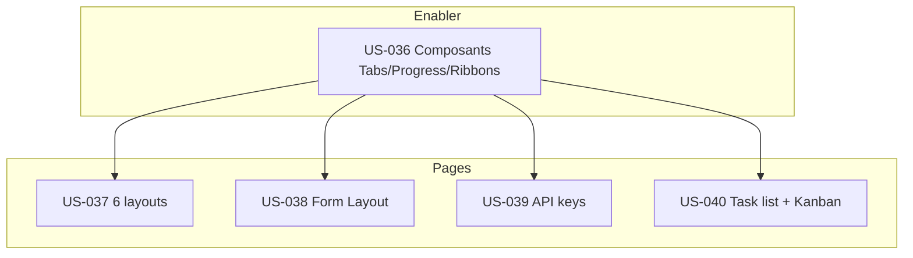

# Dépendances — Sprint 011 (composants & pages)

## Dépendances externes (livrées, prérequis stables)

- **v1.2.0** (dernière version publiée) : layout admin, composants Card/Table/Modal/Badge/Avatar/Dropdown/Button, **menu filtrable par permission** + **slots header surchargeables** (v1.2.0), thème CSS distribuable, i18n, contrôleurs Stimulus (`sidebar`, `modal`, `dropdown`, …).
- Garde d'auto-enregistrement Stimulus (US-019 / `AssetsWiringTest`) : tout nouveau contrôleur doit être déclaré dans `package.json` **et** `assets/package.json`.
- Thème de formulaire (EPIC-004) pour US-038.

## Dépendances internes au sprint

- **US-036 est l'enabler** : les pages réutilisent Tabs (réglages), Progress/Ribbons (dashboards, cartes). À livrer en premier.
- Les pages US-037→040 sont **indépendantes entre elles** → parallélisables une fois US-036 disponible.

## Chevauchements

- **Kanban** : ✅ **tranché (2026-09-09)** — porté par **US-040** (réf. TailAdmin `/task-kanban`, live) ; **retiré d'US-033** (EPIC-009). Plus de doublon.
- **Form Layout** : US-038 recoupe EPIC-004 — ici page-gabarit d'assemblage, pas de nouveaux widgets.

## Risques

| Risque | Impact | Mitigation |
|--------|--------|------------|
| 3 US au plafond de 8 pts (US-036/037/040) | Débordement de sprint | Scinder si la vélocité constatée se dégrade (composants statiques vs interactifs ; 3+3 layouts ; liste vs Kanban) |
| Accessibilité du drag-and-drop (Kanban) | Non-conformité WCAG | Alternative clavier + `aria-live` dès la conception (T-040-04) |
| Régression synchro package.json (nouveaux contrôleurs) | Contrôleurs non montés côté hôte | Tâche transverse T-TECH-02 + `AssetsWiringTest` |
