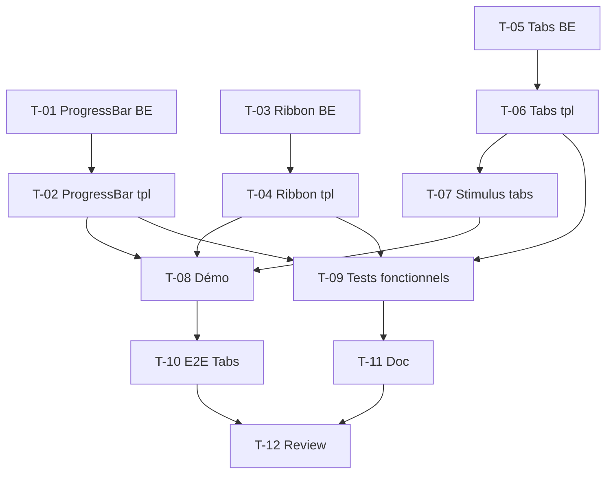

# Tâches — US-036 : Composants d'affichage (Tabs, Progress bars, Ribbons)

## Informations US
- **Epic** : EPIC-010 · **Persona** : P-001 (+ P-002) · **Points** : 8 · **Sprint** : sprint-011

## Résumé
**En tant que** développeur intégrateur **je veux** trois composants Twig du bundle
(`tsf:Ui:Tabs`, `tsf:Ui:ProgressBar`, `tsf:Ui:Ribbon`), **afin de** couvrir des motifs
d'UI courants sans réécrire de HTML/CSS custom.

## Vue d'ensemble des tâches

| ID | Type | Tâche | Est. | Dépend de | Statut |
|----|------|-------|------|-----------|--------|
| T-036-01 | [BE] | Composant `tsf:Ui:ProgressBar` (classe + bornes [0,100]) | 2h | — | ✅ |
| T-036-02 | [FE-WEB] | Template ProgressBar (`role=progressbar`, variantes, dark) | 1.5h | T-036-01 | ✅ |
| T-036-03 | [BE] | Composant `tsf:Ui:Ribbon` (classe + position/shape) | 2h | — | ✅ |
| T-036-04 | [FE-WEB] | Template Ribbon (coin/edge, dark) | 1.5h | T-036-03 | ✅ |
| T-036-05 | [BE] | Composant `tsf:Ui:Tabs` (classe + active/items) | 2h | — | ✅ |
| T-036-06 | [FE-WEB] | Template Tabs (`role=tablist/tab/tabpanel`, slots panneaux) | 2h | T-036-05 | ✅ |
| T-036-07 | [FE-WEB] | Contrôleur Stimulus `tabs` (bascule + clavier ARIA) + synchro package.json | 3h | T-036-06 | ✅ |
| T-036-08 | [FE-WEB] | Pages démo `/ui-kit` (tabs, progress, ribbons) | 2h | T-036-02, T-036-04, T-036-07 | 🔲 |
| T-036-09 | [TEST] | Tests unitaires logique (ProgressBar/Tabs) + fonctionnels rendu | 3h | T-036-02, T-036-04, T-036-06 | 🟡 |
| T-036-10 | [TEST] | E2E Panther montage Tabs (clic + navigation clavier) | 2h | T-036-08 | 🔲 |
| T-036-11 | [DOC] | `docs/components.md` : Tabs, ProgressBar, Ribbon | 1h | T-036-09 | ✅ |
| T-036-12 | [REV] | Review + revue visuelle clair/dark | 1.5h | T-036-11, T-036-10 | 🔲 |

**Total : 23.5h** — incrément 1 (bundle) livré : classes + templates + contrôleur + tests
unitaires + doc (T-01→07, 11 ✅). Reste : démo/showcase (T-08), tests fonctionnels de
rendu + E2E (T-09 🟡 partiel/T-10), review (T-12).

> **Décision d'implémentation** : dégradation gracieuse retenue (cohérence codebase
> Badge/Button) — `ProgressBar` **clampe** [0,100], `Tabs` **retombe sur le 1er onglet**
> si `active` invalide (au lieu des `LogicException` du Gherkin initial). AC à ajuster.

---

## Détail

### T-036-01 · [BE] Composant ProgressBar — 2h
**Fichiers** : `src/Twig/Components/Ui/ProgressBar.php`.
**Critères** : props `value` (0–100, validée), `variant` (brand|success|warning|error),
`size` (sm|md|lg), `label?`, `showValue` (bool) ; `LogicException` si `value` hors bornes.

### T-036-02 · [FE-WEB] Template ProgressBar — 1.5h
**Fichiers** : `templates/components/Ui/ProgressBar.html.twig`.
**Critères** : `role="progressbar"` + `aria-valuenow/min/max` ; portion remplie = `value%` ;
couleurs par variante ; dark mode ; label/valeur optionnels.

### T-036-03 · [BE] Composant Ribbon — 2h
**Fichiers** : `src/Twig/Components/Ui/Ribbon.php`.
**Critères** : props `text`, `variant`, `position` (top-left|top-right), `shape` (corner|rounded).

### T-036-04 · [FE-WEB] Template Ribbon — 1.5h
**Fichiers** : `templates/components/Ui/Ribbon.html.twig`.
**Critères** : ruban positionné dans un conteneur `relative` ; contraste ≥ 4,5:1 clair/dark.

### T-036-05 · [BE] Composant Tabs — 2h
**Fichiers** : `src/Twig/Components/Ui/Tabs.php`.
**Critères** : props `items` (`{id,label,icon?}`), `active` (id, défaut 1ᵉʳ), `variant`
(underline|pill|boxed) ; `LogicException` si `active` ne correspond à aucun item.

### T-036-06 · [FE-WEB] Template Tabs — 2h
**Fichiers** : `templates/components/Ui/Tabs.html.twig`.
**Critères** : `role="tablist"`/`tab`/`tabpanel`, `aria-selected`, `aria-controls` ;
panneaux via slots nommés par id ; panneau inactif `hidden`.

### T-036-07 · [FE-WEB] Contrôleur Stimulus tabs — 3h
**Fichiers** : `assets/controllers/tabs_controller.js`, `package.json`, `assets/package.json`.
**Critères** : bascule `aria-selected` + `hidden` au clic ; navigation clavier (flèches,
Home/End) selon le pattern ARIA Tabs ; **aucune dépendance externe** ; contrôleur déclaré
dans les DEUX package.json (garde US-019 / `AssetsWiringTest`).

### T-036-08 · [FE-WEB] Pages démo — 2h
**Fichiers** : `demo/templates/…` + entrées galerie `/ui-kit`.
**Critères** : chaque composant illustré (variantes), clair/dark, responsive.

### T-036-09 · [TEST] Tests fonctionnels — 3h
**Fichiers** : `tests/Functional/Components/…` (bundle) et/ou démo.
**Critères** : rendu des 3 composants (attributs ARIA, variantes) ; erreurs de props
(`value=140`, `active` invalide) lèvent `LogicException`.

### T-036-10 · [TEST] E2E Tabs — 2h
**Fichiers** : suite e2e démo (Panther).
**Critères** : clic bascule le panneau ; flèche droite/Home changent l'onglet actif.

### T-036-11 · [DOC] Documentation — 1h
**Fichiers** : `docs/components.md`.
**Critères** : props, slots, exemples, notes d'accessibilité.

### T-036-12 · [REV] Review — 1.5h
Relecture BE/FE + Biome ; revue visuelle clair/dark (P-002) ; DoD.

## Graphe

## Résumé
| Type | Tâches | Heures |
|------|--------|--------|
| [BE] | 3 | 6h |
| [FE-WEB] | 5 | 10h |
| [TEST] | 2 | 5h |
| [DOC] | 1 | 1h |
| [REV] | 1 | 1.5h |
| **TOTAL** | **12** | **23.5h** |
