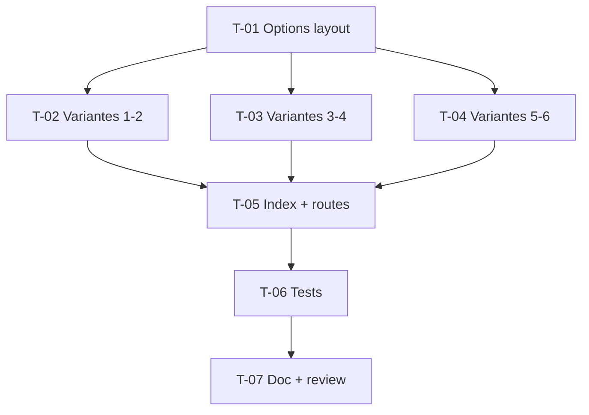

# Tâches — US-037 : Layouts d'exemple supplémentaires (6 variantes)

## Informations US
- **Epic** : EPIC-010 · **Persona** : P-001 (+ P-002) · **Points** : 8 · **Sprint** : sprint-011

## Résumé
**En tant que** développeur intégrateur **je veux** six pages illustrant des agencements
de shell admin différents, **afin de** choisir et copier l'agencement adapté sans
réinventer le layout.

## Vue d'ensemble des tâches

| ID | Type | Tâche | Est. | Dépend de | Statut |
|----|------|-------|------|-----------|--------|
| T-037-01 | [FE-WEB] | Options de layout réutilisables (blocs surchargeables / paramètre) | 3h | — | 🔲 |
| T-037-02 | [FE-WEB] | Variantes 1-2 : sidebar extensible (défaut), mini-sidebar (icônes) | 3h | T-037-01 | 🔲 |
| T-037-03 | [FE-WEB] | Variantes 3-4 : navigation horizontale, contenu boxed | 3h | T-037-01 | 🔲 |
| T-037-04 | [FE-WEB] | Variantes 5-6 : sidebar à droite, en-tête double niveau | 3h | T-037-01 | 🔲 |
| T-037-05 | [FE-WEB] | Page index « Layouts » + routes démo | 2h | T-037-02, T-037-03, T-037-04 | 🔲 |
| T-037-06 | [TEST] | Tests fonctionnels rendu des 6 variantes (200 + structure + dark) | 3h | T-037-05 | 🔲 |
| T-037-07 | [REV] | Doc layouts + review + revue visuelle | 1.5h | T-037-06 | 🔲 |

**Total : 18.5h** *(léger dépassement du plan ~16,5h — arrondi ; scinder 3+3 si besoin)*

---

## Détail

### T-037-01 · [FE-WEB] Options de layout — 3h
**Fichiers** : `templates/layout/admin.html.twig` (blocs), éventuel paramètre `tailsfadmin`.
**Critères** : piloter les variantes par **surcharge de blocs** et classes utilitaires,
sans dupliquer le shell ; réutiliser `tailsfadmin--sidebar` si bascule dynamique.

### T-037-02 · [FE-WEB] Variantes 1-2 — 3h
**Fichiers** : `demo/templates/layouts/…`.
**Critères** : sidebar extensible/rétractable ; mini-sidebar icônes (labels via `aria-label`/`title`).

### T-037-03 · [FE-WEB] Variantes 3-4 — 3h
**Critères** : navigation horizontale (menu dans le header, sans sidebar) ; contenu boxed
(largeur max centrée ≥ 1536px).

### T-037-04 · [FE-WEB] Variantes 5-6 — 3h
**Critères** : sidebar à droite (disposition inversée / RTL-friendly) ; en-tête double
niveau (barre + sous-barre d'actions).

### T-037-05 · [FE-WEB] Index + routes — 2h
**Fichiers** : `demo/` (contrôleur + template index + routes `/layouts/…`).
**Critères** : page listant les 6 variantes ; 404 sur variante inexistante.

### T-037-06 · [TEST] Tests des 6 variantes — 3h
**Critères** : chaque route → 200 + éléments clés attendus (présence/absence sidebar,
menu header, largeur boxed) ; dark mode sans inversion des gris (garde v1).

### T-037-07 · [REV] Doc + review — 1.5h
**Critères** : chaque variante étend le layout du bundle (non-duplication vérifiée en revue) ;
revue visuelle clair/dark (P-002).

## Graphe

## Résumé
| Type | Tâches | Heures |
|------|--------|--------|
| [FE-WEB] | 5 | 14h |
| [TEST] | 1 | 3h |
| [REV] | 1 | 1.5h |
| **TOTAL** | **7** | **18.5h** |
