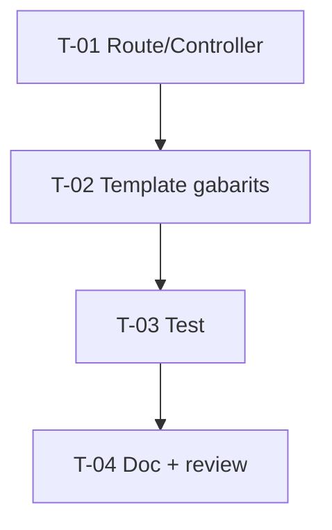

# Tâches — US-038 : Page « Form Layout »

## Informations US
- **Epic** : EPIC-010 · **Persona** : P-001 · **Points** : 3 · **Sprint** : sprint-011

## Résumé
**En tant que** développeur intégrateur **je veux** une page présentant des gabarits de
mise en page de formulaire, **afin de** copier une structure cohérente et accessible.

## Vue d'ensemble des tâches

| ID | Type | Tâche | Est. | Dépend de | Statut |
|----|------|-------|------|-----------|--------|
| T-038-01 | [FE-WEB] | Route + contrôleur démo `form-layout` | 1h | — | 🔲 |
| T-038-02 | [FE-WEB] | Template : gabarits 1 col / 2 cols / sectionné / barre d'actions | 3h | T-038-01 | 🔲 |
| T-038-03 | [TEST] | Test fonctionnel (200 + labels liés + responsive) | 1.5h | T-038-02 | 🔲 |
| T-038-04 | [REV] | Doc + review + revue visuelle | 1.5h | T-038-03 | 🔲 |

**Total : 7h**

---

## Détail

### T-038-01 · [FE-WEB] Route + contrôleur — 1h
**Fichiers** : `demo/src/Controller/…`, route `form-layout`.
**Critères** : page étend le layout admin du bundle.

### T-038-02 · [FE-WEB] Template gabarits — 3h
**Fichiers** : `demo/templates/form-layout.html.twig`.
**Critères** : **réutilise** le thème de formulaire (EPIC-004) et `tsf:Ui:Card` — aucun
nouveau widget ; formulaire 2 colonnes responsive (repli md → 1 col) ; sections avec
titres et aides (`aria-describedby`) ; barre d'actions cohérente ; i18n (US-024) ;
état d'erreur d'exemple lié au champ.

### T-038-03 · [TEST] Test fonctionnel — 1.5h
**Critères** : 200 ; chaque champ a un `<label for>` lié ; repli responsive vérifié
(ou structure grid attendue) ; aides reliées via `aria-describedby`.

### T-038-04 · [REV] Doc + review — 1.5h
**Critères** : revue confirme la non-introduction de nouveaux widgets ; a11y clavier de
la barre d'actions ; revue visuelle clair/dark (P-002).

## Graphe

## Résumé
| Type | Tâches | Heures |
|------|--------|--------|
| [FE-WEB] | 2 | 4h |
| [TEST] | 1 | 1.5h |
| [REV] | 1 | 1.5h |
| **TOTAL** | **4** | **7h** |
