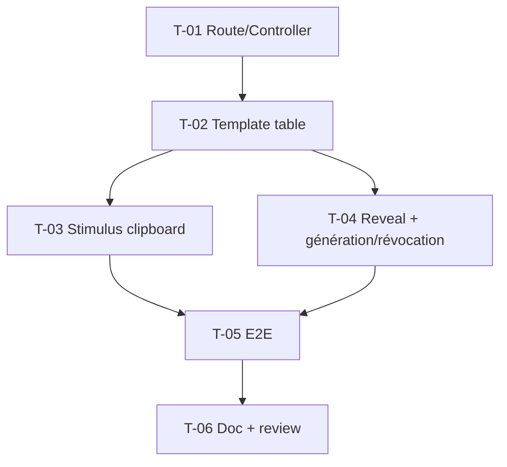

# Tâches — US-039 : Page « Integrations / API keys »

## Informations US
- **Epic** : EPIC-010 · **Persona** : P-004 (via P-001) · **Points** : 5 · **Sprint** : sprint-011

## Résumé
**En tant qu'**utilisateur de l'admin **je veux** lister mes clés d'API (masquées), en
générer/révoquer et en copier une en un clic, **afin de** configurer mes intégrations
depuis le back-office.

## Vue d'ensemble des tâches

| ID | Type | Tâche | Est. | Dépend de | Statut |
|----|------|-------|------|-----------|--------|
| T-039-01 | [FE-WEB] | Route + contrôleur démo `integrations` (données factices, session) | 1.5h | — | ✅ |
| T-039-02 | [FE-WEB] | Template : table clés masquées + statut (badge) + actions + onglets | 3h | T-039-01 | ✅ |
| T-039-03 | [FE-WEB] | Contrôleur Stimulus `clipboard` (copie + retour visuel + dégradation) + synchro 2×package.json + controllers.json | 2.5h | T-039-02 | ✅ |
| T-039-04 | [FE-WEB] | Révéler/masquer (CSS peer) + génération/révocation via `tsf:Ui:Modal` | 2h | T-039-02 | ✅ |
| T-039-05 | [TEST] | Functional (WebTestCase) + E2E Panther (copie, révéler, génération) | 2.5h | T-039-03, T-039-04 | ✅ |
| T-039-06 | [REV] | Doc (CHANGELOG) + review ; revue visuelle clair/dark → job CI `e2e` | 1.5h | T-039-05 | ✅ |

**Total : 13h**

---

## Détail

### T-039-01 · [FE-WEB] Route + contrôleur — 1.5h
**Fichiers** : `demo/src/Controller/…`, route `api-keys`.
**Critères** : données **strictement factices** (aucun secret réel) ; page étend le layout admin.

### T-039-02 · [FE-WEB] Template table — 3h
**Fichiers** : `demo/templates/api-keys.html.twig`.
**Critères** : table (nom, valeur masquée `sk_live_••••1234`, création, dernière utilisation,
statut badge) ; réutilise Table/Card/Badge/Button ; clair/dark ; responsive.

### T-039-03 · [FE-WEB] Contrôleur clipboard — 2.5h
**Fichiers** : `assets/controllers/clipboard_controller.js`, `package.json`, `assets/package.json`.
**Critères** : copie via `navigator.clipboard` + retour « Copié ! » ; **dégradation propre**
si API indisponible (sélection/message, aucune erreur JS) ; déclaré dans les 2 package.json.

### T-039-04 · [FE-WEB] Révéler/masquer + génération/révocation — 2h
**Critères** : bascule révéler/masquer par ligne ; génération dans un modal (nom + périmètre),
clé affichée **une seule fois** + avertissement ; révocation via modal de confirmation
(**pas d'`alert()`/`confirm()`**) ; validation « nom requis ».

### T-039-05 · [TEST] E2E — 2.5h
**Critères** : copie écrit dans le presse-papiers + retour visuel ; révéler affiche la clé ;
génération affiche la clé une fois ; révocation change le badge.

### T-039-06 · [REV] Doc + review — 1.5h
**Critères** : Biome ; sécurité (aucune vraie clé) ; revue visuelle clair/dark (P-002).

## Graphe

## Résumé
| Type | Tâches | Heures |
|------|--------|--------|
| [FE-WEB] | 4 | 9h |
| [TEST] | 1 | 2.5h |
| [REV] | 1 | 1.5h |
| **TOTAL** | **6** | **13h** |
