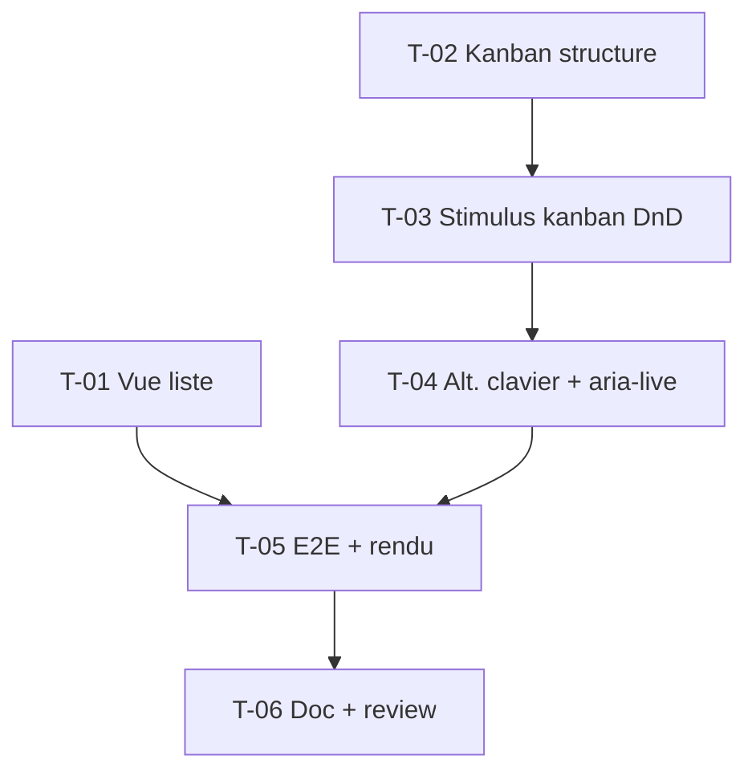

# Tâches — US-040 : Task list (liste) + Kanban

## Informations US
- **Epic** : EPIC-010 · **Persona** : P-004 (via P-001) · **Points** : 8 · **Sprint** : sprint-011

## Résumé
**En tant qu'**utilisateur de l'admin **je veux** une liste de tâches filtrable et un
tableau Kanban où je déplace les cartes, **afin de** suivre et organiser mon travail.

## Vue d'ensemble des tâches

| ID | Type | Tâche | Est. | Dépend de | Statut |
|----|------|-------|------|-----------|--------|
| T-040-01 | [FE-WEB] | Vue liste : route + table triable/filtrable (données factices) | 3h | — | 🔲 |
| T-040-02 | [FE-WEB] | Vue Kanban : route + colonnes + cartes | 2.5h | — | 🔲 |
| T-040-03 | [FE-WEB] | Contrôleur Stimulus `kanban` (drag-and-drop HTML5 natif + compteurs) + synchro package.json | 4h | T-040-02 | 🔲 |
| T-040-04 | [FE-WEB] | Alternative clavier (déplacer via menu) + annonces `aria-live` | 2h | T-040-03 | 🔲 |
| T-040-05 | [TEST] | E2E Panther déplacement carte + tests rendu liste | 3h | T-040-01, T-040-04 | 🔲 |
| T-040-06 | [REV] | Doc + review (Kanban : réf. TailAdmin `/task-kanban`) | 1.5h | T-040-05 | 🔲 |

**Total : 16h**

---

## Détail

### T-040-01 · [FE-WEB] Vue liste — 3h
**Fichiers** : `demo/src/Controller/…`, `demo/templates/tasks/list.html.twig`.
**Critères** : table de tâches (titre, assigné avatar, priorité badge, échéance, statut) ;
en-têtes triables + filtres (statut/priorité) réutilisant les composants existants ;
données factices ; clair/dark ; responsive.

### T-040-02 · [FE-WEB] Vue Kanban (structure) — 2.5h
**Fichiers** : `demo/templates/tasks/kanban.html.twig`.
**Critères** : colonnes À faire / En cours / Review / Terminé ; cartes (titre, badges,
avatars) ; compteur par colonne ; scroll horizontal sur mobile.

### T-040-03 · [FE-WEB] Contrôleur kanban (DnD natif) — 4h
**Fichiers** : `assets/controllers/kanban_controller.js`, `package.json`, `assets/package.json`.
**Critères** : glisser-déposer en **HTML5 Drag & Drop natif** (aucune lib externe / CDN) ;
déplacement met à jour colonne + ordre + compteurs ; dépôt hors colonne → retour à
l'origine (aucune perte, aucune erreur JS) ; déclaré dans les 2 package.json.

### T-040-04 · [FE-WEB] Alternative clavier + a11y — 2h
**Critères** : menu d'actions par carte (« Déplacer vers … ») utilisable au clavier ;
annonces `aria-live` du déplacement.

### T-040-05 · [TEST] E2E + rendu — 3h
**Critères** : E2E Panther déplace une carte entre colonnes (compteurs mis à jour) ;
tests fonctionnels de rendu de la vue liste (tri/filtre).

### T-040-06 · [REV] Doc + review — 1.5h
**Critères** : Biome ; conformité à la **réf. TailAdmin `/task-kanban`** (chevauchement
US-033 tranché : Kanban porté ici) ; DnD natif sans import non vendoré vérifié ; revue
visuelle clair/dark (P-002).

## Graphe

## Résumé
| Type | Tâches | Heures |
|------|--------|--------|
| [FE-WEB] | 4 | 11.5h |
| [TEST] | 1 | 3h |
| [REV] | 1 | 1.5h |
| **TOTAL** | **6** | **16h** |
